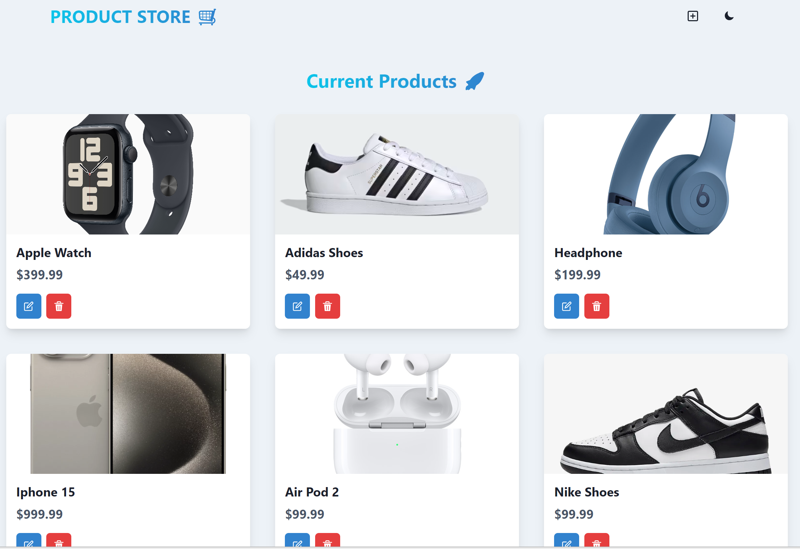

# Product Management App

## Project Overview
This application is designed to manage products effectively, allowing users to create, update, and delete products while storing all data in a MongoDB database. 

## Key Features
- ⚛️ **Tech Stack**: Built with React.js, Node.js, Express.js, MongoDB, and Chakra UI.
- 🔥 **Robust API**: Efficiently handles product management operations.
- 📱 **Responsive UI**: User-friendly and responsive interface powered by React.js and Chakra UI.
- 🌐 **Deployment Ready**: Easily deployable for production use.

## Technologies Used
- **Frontend**: React.js, Chakra UI
- **Backend**: Node.js, Express.js
- **Database**: MongoDB

## How to Run
To run this app locally, follow these steps:

1. **Clone the repository**:

   ```bash
   git clone https://github.com/tringo286/Product-Store.git
   cd Product-Store
   
2. **Setup .env file**:

    ```bash
    MONGO_URI=your_mongo_uri
    PORT=5000

3. **Build the app**:

    ```bash
    npm run build

4. **Start the app**:
    
    ```bash
    npm run start
    
## DEMO



## Deployed Website
You can access the live version of this application at: [Product Store](https://product-store-8jwf.onrender.com/)

### Thank you for checking out this project! 🙌 
